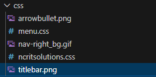
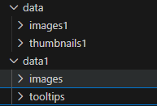
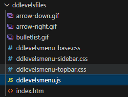
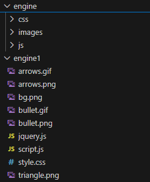
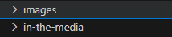
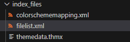
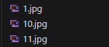
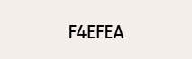
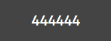

# School Website Modernization

## Overview
This project involves converting a legacy school website built using early HTML standards (HTML 1.x) into a modern HTML5 website. The objective is to preserve existing content and assets while improving structure, readability, maintainability, and adherence to modern web standards. This project is focused on modernization rather than redesign.

## Tech Stack
HTML5  
CSS3  

## Process

### Reviewing the legacy project files
The first step in the modernization process is to review and audit the original project files. This helps identify which files and assets should be retained, reused, or discarded during development.

These files are discarded as they are not required for the modern website and do not contribute to functionality or content.

This folder contains banner images used across the website. These assets are important and will be reused in the modern HTML5 version.

These files do not contain useful styling information. They primarily include report-related data about NCR IT Solutions, the company that originally developed the website, and are therefore excluded.

This folder contains core image assets used throughout the website. These images are important and will be retained.

This folder contains data related to legacy arrow symbols and outdated UI elements. These are not relevant to modern web development and are discarded.

The engine and engine1 directories contain legacy engine and symbol-related files. These files are not required for a modern HTML5-based website.

This folder contains important images related to the school and its management. These assets will be preserved.

These files are not used in the modern implementation and are therefore discarded.

This folder contains images related to news cut-outs and media mentions. These images are preserved for content and historical reference.

#### Color Palette

##### Primary Color (Brick / Terracotta)
Used for headers, navigation bar, footer, and key highlights.

Hex values:
- #9C3F2E  
  

- #A64B3C  
  

##### Secondary Color (Cream / Beige)
Used for page background and content sections.

Hex values:
- #F4EFEA  
  

- #F7F2ED  
  

##### Neutral Color (Dark Gray)
Used for body text, headings, and borders.

Hex values:
- #2F2F2F  
  

- #444444  
  

##### Accent Color (Muted Green)
Used for buttons, links, notices, and interactive elements.

Hex values:
- #2E6B4E  
  

- #3F7F5F  
  
